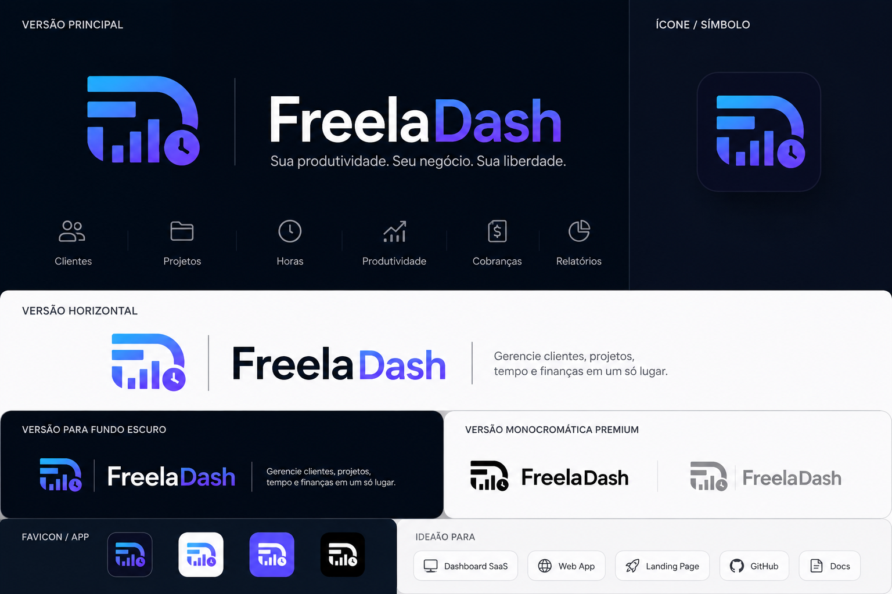

# FreelaDash



Dashboard pessoal para freelancers gerenciarem clientes, projetos, registros de horas e cobranças em BRL.

## Rodar localmente

```powershell
npm install
npm run seed
npm run dev
```

Depois abra:

```text
http://localhost:3000/login
```

Login de teste:

```text
Email: ana@freeladash.dev
Senha: 123456
```
